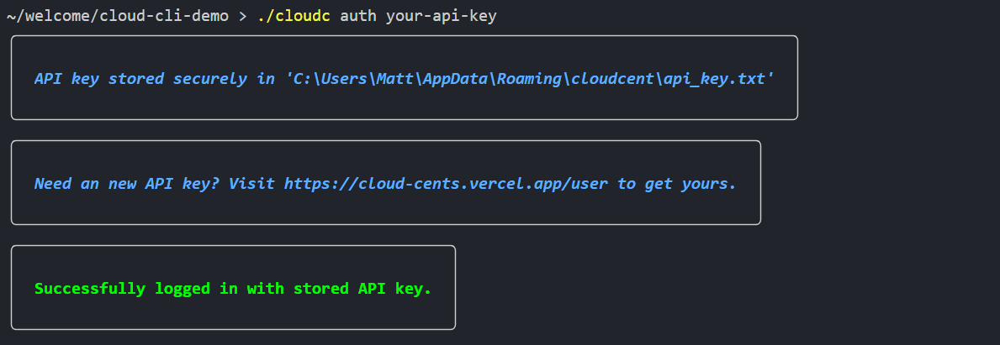

# Cloud Cents CLI 

## 🚀 Installing

```sh
wget | curl https://github.com/cloudcents-ai/cli/cloudcents
chmod +x cloudcents
echo 'export PATH=$PATH:'$(pwd) >> ~/.bash_profile
source ~/.bash_profile
```

## 🏁 Getting Started



```sh
cloudcents auth <your-api-key>    # 🔑 Authenticate with your API key
cloudcents checklist              # ✅ View and complete your task checklist
cloudcents prices                 # 💲 Get pricing for AWS, GCP, and Azure
cloudcents chat                   # 💬 Chat with the Cloud Cents API
```